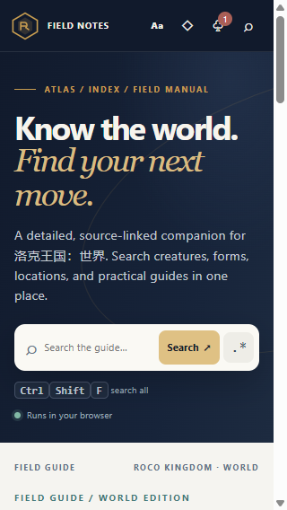
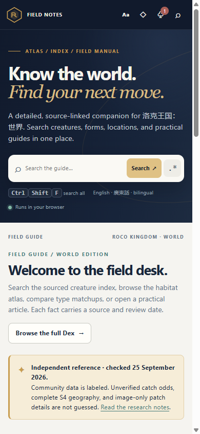

# Roco Kingdom: World Field Guide

An independent, source-linked reference for **Roco Kingdom: World**. This edition combines a bilingual field guide, searchable creature and form Dex, connected skill and evolution records, type matchups, a named-location index, and practical articles.

## Edition contents

The current event desk rechecked the September 25 weekend and Flower Seed notices on 2026-09-27. The Cocoa preview was last read on 2026-09-26. Missing time zones, encounter odds, and unconfirmed reward or claim details remain marked unknown.

- **Creature Dex:** this edition's saved snapshot has 625 form rows across 466 catalog numbers, reviewed on 2026-09-24. The live [BiliWiki list](https://wiki.biligame.com/nrc/%E7%B2%BE%E7%81%B5%E5%88%97%E8%A1%A8) displayed 621 results when checked on 2026-09-25 and carries a 2026-09-13 update date; the independent [Roco Kingdom World index](https://rocokingdomworld.org/pokedex/) reported 644 entries. Their snapshot dates, row labels, and numbering rules do not establish a one-to-one roster comparison or an official total. Open a local record for its original catalog fields and linked handbook tasks, habitat, skills, evolution paths, affinity, ecology, and type matchup data where the pinned source provides an exact match.
- **Reference snapshot:** commit `71eba6e4cd5e0f01a5cda60ec5560f58aae2a1c2`, version `s4-2026-09-24`, published 2026-09-24 15:55:24 UTC+8. It contains 824 skills, 311 learnsets, 275 evolution groups, 466 handbook entries, 2,342 handbook task topics, and 120 type combinations. It is community data, may lag the live client, and is licensed CC BY-NC-SA 4.0.
- **World index:** 43 named S3 map labels, 57 handbook habitat labels, and three handbook index areas. The linked external viewer reported 7,148 points across seven categories on its homepage when checked on 2026-09-25. That self-reported count is not audited or comparable to the local label index. The sources do not provide local verified coordinates, routes, or a complete S4 access map, and the external map data and artwork are linked, not copied.
- **Articles:** 21 original English and written-Cantonese articles covering first sessions, combat, team building, capture, breeding, exploration, progression, currencies, bosses, event notes, source methods, roster-count differences, and how to use each data section.
- **Narrow screens:** the compact header hides its repeated secondary wordmark below 520 px and keeps the edition label in the context row below. The built page was captured and reviewed at 390×844 and 320×568 in English, light theme, and 100% scale. The body fits each viewport without horizontal overflow, and the shorter global search hint fits at both widths. These two captures do not establish desktop layout, keyboard-path behavior, or the full language, theme, and scale matrix.
- **Artwork:** no creature portraits, game map tiles, or external map imagery are included.
- **Privacy:** the browser edition is static and anonymous. Saved notes and preferences stay in the current browser. The desktop companion reports session status only after an explicit opt-in and only when its private Status Hub configuration is present. Search terms, saved notes, bookmarks, and reading history are never reported. The project source declares no analytics, trackers, remote fonts, or third-party scripts. The hosting layer may inject a same-origin challenge script outside the project bundle.

## Open the guide

- **GitHub Pages status:** `https://ding-ding-projects.github.io/roco-kingdom-world-guide/` is the planned address. Pages is not configured yet, so the address is not live or verified.

- **Planned public edition:** the guide will be available at `https://ding-ding-projects.github.io/roco-kingdom-world-guide/` after the first verified Pages deployment.
- **Local browser copy:** the static entry point is [`dist/index.html`](dist/index.html). Serve the `dist/` directory over HTTP so its JSON data can be fetched from the same origin. Opening the file directly with a `file:` URL is not supported by browser fetch rules. No package installation or build step is required.
- **Offline desktop companion:** a Windows installer and update package will be linked here after a verified desktop release. It bundles the same `dist/` guide and keeps working without a network connection. Optional status reporting stays off until enabled by the user.

## Responsive review

The existing captures in [`evidence/responsive-header/`](evidence/responsive-header/) document a prior source revision at 320×568 and 390×844. They are historical evidence and do not verify the current GitHub Pages or desktop build. Only the two English, light-theme, 100%-scale narrow viewports were reviewed at that revision. Current desktop rendering, keyboard navigation, and the full language, theme, and display-scale matrix remain unverified.





## Documentation

- [Creature Dex and joined details](docs/dex/README.md)
- [World location and habitat index](docs/map/README.md)
- [Type matchup reference](docs/combat/README.md)
- [Field articles](docs/guides/README.md)
- [Current season notes](docs/current-season/README.md)
- [Privacy, settings, and exports](docs/tools/README.md)
- [GitHub Pages and desktop distribution](docs/distribution/README.md)
- [Status reporting](docs/tools/status-reporting.md)
- [Design handoff and limits](design/README.md)
- [Data attribution and reuse](DATA-LICENSE.md)
- [Project handoff](HANDOFF.md)
- [Roadmap](ROADMAP.md)

## Refresh the data

The BWiki importer consumes a locally saved source page and excludes portrait bytes. The joined snapshot builder consumes a checked-out `rocom-wiki-data` source tree and exact source revision metadata.

```powershell
python scripts/import_bwiki_dex.py $env:TEMP\roco-dex-source.html dist/data/creatures.json --checked-on 2026-09-24 --community-updated-on 2026-09-13
python scripts/build_reference_snapshot.py --source-root $env:TEMP\rocom-wiki-data --project-root . --source-commit 71eba6e4cd5e0f01a5cda60ec5560f58aae2a1c2 --source-version s4-2026-09-24 --source-updated-on "2026-09-24 15:55:24 UTC+8"
```

After a refresh, review source dates, licensing, record joins, counts, missing values, and the published data files. Keep the exact upstream revision beside the generated data.
